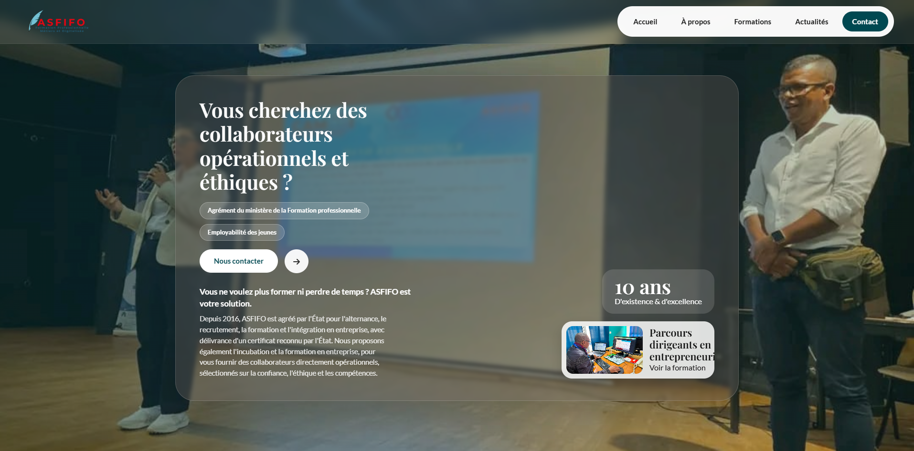

# React + TypeScript + Vite

This template provides a minimal setup to get React working in Vite with HMR and some ESLint rules.

Currently, two official plugins are available:

- [@vitejs/plugin-react](https://github.com/vitejs/vite-plugin-react/blob/main/packages/plugin-react) uses [Oxc](https://oxc.rs)
- [@vitejs/plugin-react-swc](https://github.com/vitejs/vite-plugin-react/blob/main/packages/plugin-react-swc) uses [SWC](https://swc.rs/)

## React Compiler

The React Compiler is not enabled on this template because of its impact on dev & build performances. To add it, see [this documentation](https://react.dev/learn/react-compiler/installation).

## Expanding the ESLint configuration

If you are developing a production application, we recommend updating the configuration to enable type-aware lint rules:

```js
# ASFIFO Frontend

Interface web publique et espace d'administration ASFIFO. L'application est une SPA React qui consomme l'API Laravel du dépôt [`../ASFIFO-BACK`](../ASFIFO-BACK).

## Fonctionnalités

- Pages publiques : accueil, présentation, formations, blog, détail d'article et contact.
- Connexion administrateur et espace `/admin/*` protégé.
- Consultation et gestion des articles et messages via l'API backend.
- Navigation client avec React Router et appels HTTP centralisés avec Axios.
- Interface responsive stylée avec Tailwind CSS et feuilles CSS locales.

## Stack technique

| Composant | Technologie |
|---|---|
| UI | React 19 + TypeScript |
| Build | Vite 8 |
| Navigation | React Router 7 |
| API | Axios |
| Styles | Tailwind CSS 4 + CSS |
| Icônes et interactions | Lucide, React Icons, Motion, Swiper |

## Prérequis

- Node.js compatible avec les dépendances du projet
- pnpm recommandé, car le dépôt contient `pnpm-lock.yaml`
- API ASFIFO démarrée localement ou accessible depuis l'environnement cible

## Installation et démarrage

```bash
pnpm install
pnpm dev
```

L'application est ensuite disponible sur l'URL affichée par Vite, généralement `http://localhost:5173`.

Commandes disponibles :

```bash
pnpm build       # vérification TypeScript puis build de production
pnpm lint        # ESLint
pnpm preview     # prévisualisation du build généré
```

## Configuration

Créer un fichier `.env.local` à la racine du frontend :

```env
VITE_API_URL=http://127.0.0.1:8000/api
VITE_BACKEND_URL=http://127.0.0.1:8000
```

`VITE_API_URL` est l'URL de base des appels API. `VITE_BACKEND_URL` sert notamment à résoudre les ressources hébergées par Laravel, comme les images d'articles. En l'absence de variables, ces deux valeurs locales sont utilisées automatiquement.

Le backend doit autoriser l'origine Vite dans sa configuration CORS.

## Authentification

La connexion admin reçoit un token Sanctum. Le module `src/lib/api.ts` ajoute automatiquement ce token aux requêtes Axios. Une réponse `401` efface la session et redirige vers `/login`.

La session est stockée par défaut dans `sessionStorage`; le choix `localStorage` est disponible via `setAuthSession(..., 'local')`. Ne placez jamais de token ou de secret dans le code source ou dans une variable `VITE_*` destinée à être privée : ces variables sont intégrées au bundle navigateur.

## Structure du projet

```text
src/
├── admin/          # routes, composants et types du backoffice
├── components/     # composants partagés et authentification
├── lib/            # client API et gestion de session
├── pages/          # écrans publics
├── App.tsx         # routes principales
└── main.tsx        # point d'entrée React
```

## Routes principales

| URL | Écran |
|---|---|
| `/` | Accueil |
| `/a-propos` | Présentation |
| `/formations` | Formations |
| `/blog` | Liste des articles |
| `/blog/:slug` | Détail d'un article |
| `/contact` | Formulaire de contact |
| `/login` | Connexion administrateur |
| `/admin/*` | Backoffice protégé |

## Dépannage

- **Erreur réseau** : vérifier que Laravel écoute sur `127.0.0.1:8000` et que `VITE_API_URL` pointe vers `/api`.
- **Erreur CORS** : ajouter l'origine exacte affichée par Vite dans la configuration CORS du backend.
- **Redirection répétée vers `/login`** : vérifier la validité du token Sanctum et les logs Laravel.
- **Images absentes** : exécuter `php artisan storage:link` dans le backend et contrôler `VITE_BACKEND_URL`.

## Licence et responsabilité

Projet interne ASFIFO — tous droits réservés.

Responsable : Fabrice Faniry RANDT, Eray Digital.